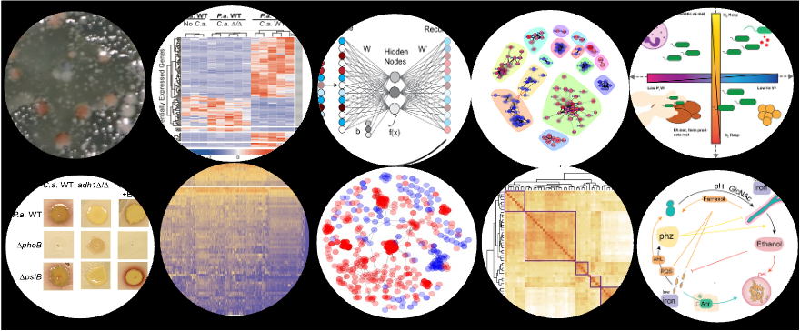

# \textcolor{black}{CSC 483: Special Topics - Applied Biological Data Science}

* Union College, Winter 2026
* Georgia Doing, PhD
* email: doingg@union.edu
* office: Steinmetz 108B

{ width=600px }



#  COURSE BASICS

* Lecture: Tuesday/Thursday 1:55 am - 3:40 pm
* Location: ISEC 070
* Student/Office Hours: 
	* Wednesday  2:00 pm - 3:30 pm
	* Thursday      4:00 pm - 5:30 pm
	* subject to change, check course website for most up-to-date schedule
	* drop-in or schedule a 15 minute slot: 
		<https://calendar.app.google/8bus6pfDvyphR9ar5>
	* by appointment for another time or over zoom

# OVERVIEW

In this course we will gain familiarity and practice in methods of analyzing biological sequence data and the large datasets that have resulted from decades of high-throughput experimentation. We will follow how data are turned into biological knowledge through the general workflow of (1) sequence alignment, (2) dimensionality reduction and (3) statistical, comparative hypothesis testing. At each stage we will compare state-of-the-art deterministic methods with emerging machine learning-based counterparts and interrogate trade-offs in performance and interpretability. We will explore the role of interdisciplinary communication in biological data science and the iterative process of program development and implementation in exploring the great biological unknowns.  This course will use Python and R and introduce libraries useful in applied computer science and guidance on how different approaches are used in different contexts. No prior biological knowledge will be assumed.

Prerequisite(s): MTH 197 and a C- or higher in CSC 151. Recommended: CSC 250.  MTH 199 can be substituted for MTH 197 CC: SET Note: Course can be repeated for credit under different topics.  Consult with the department chair for more information.

# LEARNING OBJECTIVES

By the end of the course, you should be able to \textit{answer} the following questions:}

\begin{itemize}

\item{How is sequence data transformed into quantitative data?}
\item{What are the fundamentals of data wrangling?}
\item{What are best practices in data visualization?}
\item{How can data be communicated between data scientists and biologists?}

\end{itemize}

By the end of the course, you should be able to \textit{do} the following:

\begin{itemize}

\item{Aquire and prepare data for analysis.}
\item{Conduct descriptive data exploration.}
\item{Communicate findings of an independent project.}

\end{itemize}

A 1-page schedule-at-a-glance is included at the end of the syllabus, but please see the course website more detailed schedule.

# CLASS POLICIES AND GUIDELINES

The Computer Science Department as a whole welcomes all people, regardless of age, background, beliefs, ethnicity, gender identity, gender expression, national origin, religious affiliation, sexual orientation and any other differences, be they visible or non-visible. It’s also important to recognize that institutional racism has prevented members of marginalized groups - especially black, indigenous and other people of color (BIPOC) - from fully participating in the field of Computer Science. 

***You. Yes you, the one reading this syllabus. You belong here.***

As an instructor, I will do my utmost to uphold these principles and to treat everyone with respect. As students in this class, I expect you to do the same since one person is not a community unto themselves. We’re all in this together, so let’s treat each other well. Lastly, I welcome feedback on issues we might discuss or ways that our class can be a more just one for all people.

# COURSE MATERIALS

Online Textbook: Runestone (free).

We are going to use an online, interactive, free and open source textbook. This textbook has a lot of embedded interactive exercises. Reading this book always also means doing the activities. To get access to the book, please register on Runestone using the following informationm which can also be found on Nexus:

* <https://runestone.academy/runestone/default/user/register>
* your Union College email 
*  unioncollege_py4e-int_fall25 as the course name

We’ll use the following websites and software throughout the course:

*	Rosalind problems: <https://rosalind.info/classes/enroll/750c73565c/> 
*	The course website: <https://georgiadoing.github.io/tufte-quarto/>
*	Google Colab: the could-based platform to write and run Jupyter Notebooks with python code
	+ Pro account sign-up: <https://colab.research.google.com/signup>
	+ Use your Union email

# COURSE RESOURCES

The course website has a list and links to the readings and software resources that we are going to use. In class, we are going to use the Linux machines in ISEC 070. Outside of class you have a choice of hardware. You can access Google Colab via a browser on your own machine, install the software on your own computer (Python is freely available for Windows, Mac, and Linux) or you can work in one of the Computer Science labs. We have three spaces that you can use 24/7 using your ID card, except when classes are being held in them:

*	Olin 107 
*	PASTA Lab (ISEC 051+)
*	Computer Science Resource room (Steinmetz Hall, 209A)

# LIBRARY RESOURCES

The library is available to help you with your research needs! Librarians can help you develop research questions, search for and select the best sources for your projects, identify research strategies, evaluate sources, and assist you with creating citations. There are multiple ways for you to contact a librarian. For more information, please see our Ask A Librarian page: <https://www.union.edu/schaffer-library/ask-a-librarian>.

# ACCOMODATIONS 

It is the policy of Union College to make reasonable accommodations for qualified individuals with disabilities. If you are a person with a disability and wish to request accommodations to complete your course requirements, please make an appointment with me or stop by during my office hours as soon as possible, all discussions will remain confidential. You must provide reasonable notice and be in touch with Accomodative Services on the 2nd floor of Schaffer Library, if you have not already, if you wish to take advantage of extra time on exams.

# GRADING

The following components will contribute to your final grade for this class with roughly the indicated weight.

*	Final project: 25%
*	Final oral exam: 25%
*	Problem sets: 25%
*	Peer review: 25%

Letter Grade Scale:

*	A: 93-100; A-: 90-92
*	B+: 87-89; B: 83-86; B-: 80-82
*	C+: 77-79; C: 73-76; C-: 70-72
*	D: 60-69; F: 0-59

# LATE POLICIES

Homework assignments will usually be discussed in class on the day that they are due and thus, without prior agreement, there is NO late submission of assignments allowed. You have three “extension tokens” that can be used for due dates related to your final project for this class. Each token will extend a single project deadline by 24 hours. You can use each token on a different deadline, or use two or even all three on a single deadline. Once all three tokens have been used, no late submissions will be accepted (barring exceptional circumstances). 

<https://forms.gle/ZcEss9oNayecL8zr7>

# ATTENDANCE

Class participation is a critical component of the course and attendance is mandatory. I realize that sometimes other things come up (interviews, athletic events, illness, etc.). In those cases, just let me know (in advance, if at all possible) that you are going to be absent. You may not receive credit for make-up material if you did not discuss your absence with me prior to class. No matter how much class you have missed, please do not come to class if you have an illness that is likley contageous, please email me to work out a reasonable solution.

If you do miss class, it is your responsibility to make up any material that you missed. Get notes from a classmate, make sure to complete all homework assignments due or assigned during the class that you missed, and come see me if you have any questions on the material. Unless you have made an arrangement with me ahead of time or you had an emergency, I will expect you to hand in all assignments by the due date, regardless of whether you were in class. You will not be able to make up missed exams or in-class questions and assignments.

Attendence in class constitutes being present, respectful and engaged. Accessing off-topic websites or software, checking email or phones, *utilizing large language models* or otherwise attending to things not pertinant to the course is distracting to yourself and others and will result in a reduction of your overall grade, up to a 0.5% reduction per class.

# PARTICIPATION AND ENGAGEMENT		

 Following these guidelines will constitute postiive engagement:

* Respect. This course is a space for rigorous and respectful debate. When confronting ideas and people different from you, lead with curiosity rather than judgement. This commitment extends to all our face to face and digital interactions. We will critique ideas, not people. To protect our shared learning environment, you may not record, photograph, or share any part of our class sessions outside of our class. 

* Show up to class on time and prepared. Show up ready to learn by completing the readings and exercises. When you are late or unprepared, you are disrespecting the learning experience for the group.

* Embrace intellectual humility. Recognize that there are limitations to your knowledge and that some of your beliefs could actually be wrong. Be curious about your thinking and open to learning from others. This is hard, but so vital to your learning in this course—we’ll work on developing this throughout the term!

* Get help when you need it. If you are stuck or confused or lost, be proactive and get help. The best learners and thinkers can figure out when they are stuck and make a plan to get unstuck. Come to Office Hours (Wed/Thurs 2:00-3:30pm Steinmetz 108B), the CS Helpdesk (Sun-Thurs 7:00-9:00pm Olin 107) or ask another student. Often the best person to explain something is the person who just figured it out. Try reaching out to another student in the course who seems like they get it—they will probably be flattered you asked!

# ACADEMIC INTEGRITY AND "ARTIFICAL INTELLIGENCE" USE

Union College recognizes the need to create an environment of mutual trust as part of its educational mission. Responsible participation in an academic community requires respect for and acknowledgement of the thoughts and work of others, whether expressed in the present or in some distant time and place. Matriculation at the College is taken to signify implicit agreement with the Academic Honor Code, available at: <http://muse.union.edu/honorcode>

It is each student’s responsibility to ensure that submitted work is their own and does not involve any form of academic misconduct. Students are expected to ask their course instructors for clarification regarding, but not limited to, collaboration, citations, and plagiarism. Ignorance is not an excuse for breaching academic integrity. Students are also required to affix the full Honor Code Affirmation, or the following shortened version, on each item of coursework submitted for grading: 

Union College has an honor code as follows. That material will appear in every notebook you submit to me for grading. 

> As a student at Union College, I am part of a community that values intellectual effort, curiosity and discovery. I understand that in order to truly claim my educational and academic achievements, I am obligated to act with academic integrity. Therefore, I affirm that I will carry out my academic endeavors with full academic honesty, and I rely on my fellow students to do the same.

Scholastic dishonesty is misrepresenting someone else's work as your own and will not be tolerated. 

For this class in particular, we encourage working together during class time. If you missed something, talk to me, talk to your classmates or reach out via piazza or helpdesk. However ALL HOMEWORK must be completed individually. 
You are encouraged to:

*	Talk about concepts in solutions
*	Discuss ideas
*	Look up online documentation, or examples

You MAY NOT:

*	Share code
*	Look at another student’s code
*	Look up solutions to specific problems on the internet
*	Copy or paste any text or code to or from a large language model

Ultimately, I may choose to call you into office hours to explain the choices you made in solving a problem. You should be comfortable with explaining the choices you made, how that choice was implemented and why. 

Your goal for discussions about any assignment should be that you come away with a better understanding of the problem and of possible ways to approach it so that you can then try out these approaches on your own. You should never leave a discussion with just an answer, without an understanding of how to arrive at that answer. 
A good general guideline for any discussion, or interaction with an AI model, is that you should not leave the discussion with anything written or typed.

# CONTACTING ME OUTSIDE OF CLASS

The best method for contacting me outside of class is to stop by my office during Office Hours or whenever my office door is open. You can also schedule a time with me if my regular office hours don’t work. Please contact me via email (doingg@union.edu) and we can arrange a phone or zoom call. I respond to emails as soon as possible, but it may take up to one day to get a response during the term, and longer between terms.

# ADDITIONAL RESOURCES

*Mental Health and Campus Resources*

Union College is committed to supporting and advancing the mental health and well-being of our students. During the course of their academic careers, students often experience personal challenges that contribute to barriers in learning, such as drug/alcohol problems, strained relationships, chronic worrying, persistent sadness or loss of interest in enjoyable activities, family conflict, grief and loss, domestic violence, difficulty concentrating, problems with organization, procrastination and/or lack of motivation. Students also sometimes come to college with a history of learning difficulties (e.g., any form of special education), experience difficulties succeeding in a particular subject (e.g., math, reading), or have experienced some form of trauma be it emotional or physical (e.g., head injury). These mental health concerns can lead to diminished academic performance and can interfere with daily life activities. If you or someone you know has a history of mental health concerns or if you are unsure and would like a consultation, a variety of confidential services are available. The Eppler-Wolff Counseling Center provides free counseling and therapy services (including psychiatry) to all enrolled students. Please call (518) 388-6161 or visit the Wicker Wellness Center in person any weekday between 8:30 and 5:00 to schedule an initial contact appointment. Visit the Counseling Center website for more information.

In a crisis situation, or after hours, contact Campus Safety at (518) 388-6911. The National Suicide Prevention hotline also offers a 24-hour hotline at (800) 273-8255.

Any student who faces challenges securing their food or housing and believes this may affect their performance in the course is urged to contact the Dean of Students (dos_office@union.edu) for support or drop into office hours Monday - Friday 8:30 am - 5:00 pm in the Reamer Campus Center room 306. Furthermore, please notify me if you are confortable doing so and I will provide any resources I can. The Union College Persistance Fund can provide financial support in times of unexpected harship to cover needs such as emergency medical expenses not covered by insurance and basic living expenses. Additional sources of supoprt are outlines on the Dean of Students webpage: <https://www.union.edu/dean-students> .

## ADDENDA

Any community agreed upon additions:

&nbsp;

&nbsp;

&nbsp;

&nbsp;

&nbsp;

&nbsp;

&nbsp;

&nbsp;



# TENTATIVE SCHEDULE

| W | TOPIC                                   | Due                              | Notes|
| ---- | --------------------------------------- | ---------------------- |----------:|
| 1    | Scope of Biological Data          | HW 01              | 
|      |                                         | &emsp;         |
| 2    | Arc of Analyses  | HW 02                             |
|      |                                         | &emsp;           |
| 3    | Sequence Alignment                      | HW 03, Project Proposal                            |
|      |                                         | &emsp;          |
| 4    | Data Wrangling                  | HW 04   | 
|      |                                         | &emsp;          |
| 5    | Dimensionality Reduction                      |  Exploratory Analyses           |
|      |                                         | &emsp;   |
| 6    | Visualization                          | Figure Drafts     |
|      |                                         | &emsp;         |
| 7    | Hypothesis Testing                            |  Results        |
|      |                                         | &emsp;          |
| 8    | Peer Review                  |  Peer Review  | 
|      |                                         | &emsp;          |
| 9    | Methodological Comparative Analysis                            |  Response to Reviewers          |
|      |                                         | &emsp;         |
| 10   | Project Presentations           | Final Project & Presentation  |
|      |                                         |                                  |



# PROGRESS TRACKER

| Learning Goals                     | Week 1 | Week 2 | Week 3 | Week 4 | Week 5 | Week 6 | Week 7 | Week 8 | Week 9 | Week 10|
| --------------------------| ------ | ------ | ------ | ------ | ------ | ------ | ------ | ------ | ------ | ------- |
| How is sequence |  &emsp;  |  &emsp;   |  &emsp;  |   &emsp;  |  &emsp;   |  &emsp;    |  &emsp;   |  &emsp;   | &emsp;   |  &emsp;   |
|  data transformed   |        |        |        |        |        |        |        |        |        |         |
|  into quantitative   |        |        |        |        |        |        |        |        |        |         |
| data    |        |        |        |        |        |        |        |        |        |         |
| &emsp;  |        |        |        |        |        |        |        |        |        |         |
| Data                                            |        |        |        |        |        |        |        |        |        |         |
| wragling                                            |        |        |        |        |        |        |        |        |        |         |
| &emsp;  |        |        |        |        |        |        |        |        |        |         |
| &emsp;  |        |        |        |        |        |        |        |        |        |         |
| Data                                            |        |        |        |        |        |        |        |        |        |         |
| visualization                                            |        |        |        |        |        |        |        |        |        |         |
| &emsp;  |        |        |        |        |        |        |        |        |        |         |
| Interdisciplinary                                             |        |        |        |        |        |        |        |        |        |         |
| communication                                            |        |        |        |        |        |        |        |        |        |         |
| &emsp;  |        |        |        |        |        |        |        |        |        |         |
| Aquire and 
 prepare data                                                 |        |        |        |        |        |        |        |        |        |         |
| &emsp;  |        |        |        |        |        |        |        |        |        |         |
| Descriptive                                                 |        |        |        |        |        |        |        |        |        |         |
| analysis                                                  |        |        |        |        |        |        |        |        |        |         |
| &emsp;  |        |        |        |        |        |        |        |        |        |         |
| Independent                                                 |        |        |        |        |        |        |        |        |        |         |
| project                                                  |        |        |        |        |        |        |        |        |        |         |

